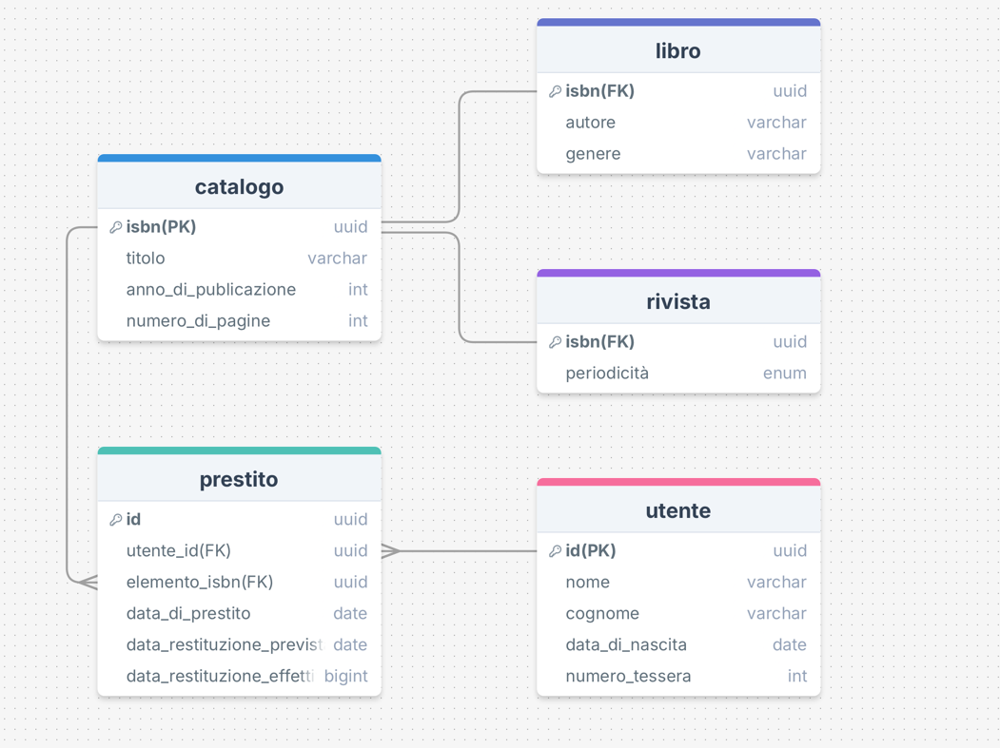

1. Creo la tabella padre con i rispettivi attributi:

- Catalogo:
    - ISBN
    - Titolo
    - Anno di publicazione
    - Numero di pagine

Le classi figli sono:

- Libro:
    - Super(Ereditano tutte gli attributi di Catalogo)
    - Autore
    - Genere

- Riviste:
    - Super(Ereditano tutte gli attributi di Catalogo)
    - Periodicità (enum)

2. Creo le classi:

- Utente:
    - Nome
    - Cognome
    - Data di nascita
    - Numero di tessera

- Prestito:
    - Utente
    - Elemento prestato
    - Data di prestito
    - Data di restituzione prevista
    - Data di restituzione effettiva

*Le relazioni tra le classi sono:*

- OneToOne: classe Libro(figlio) e Rivista(figlio) hanno lo stesso ISBN nella classe Catalogo(padre);
- OneToMany: classe Utente ha un solo id per la classe rispettiva ma tanti id per la classe Prestiti;
- OneToMany: classe Catalogo ha un ISBN che a sua volta ha può avere diversi ISBN nella classe Prestiti;

